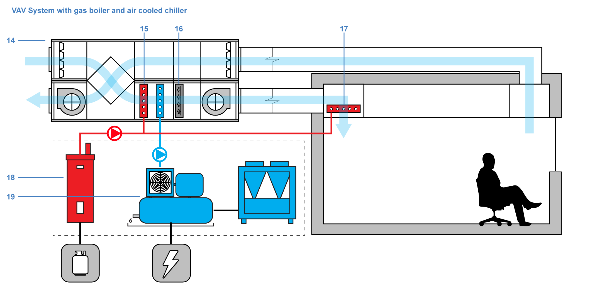
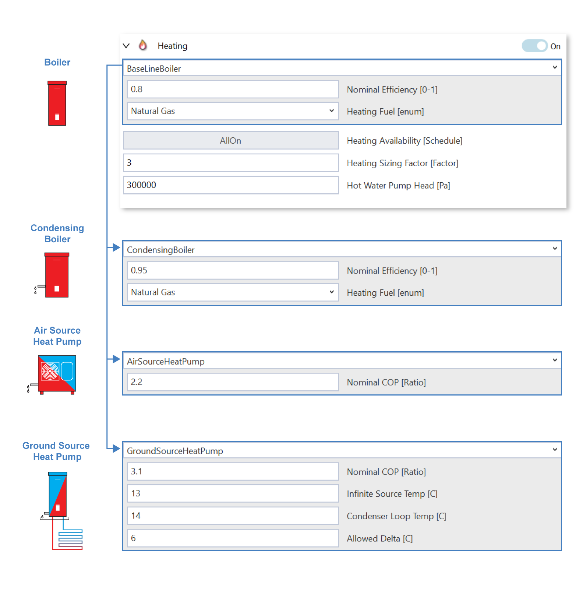
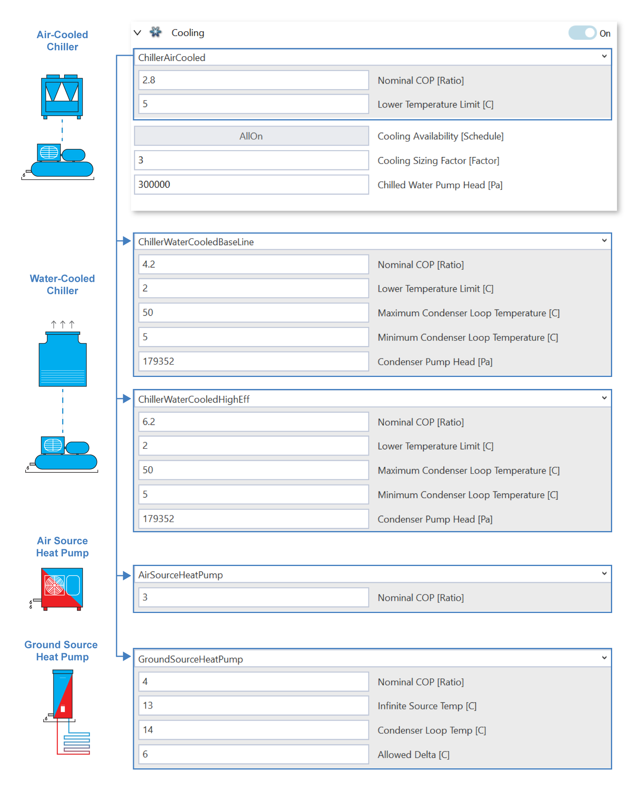
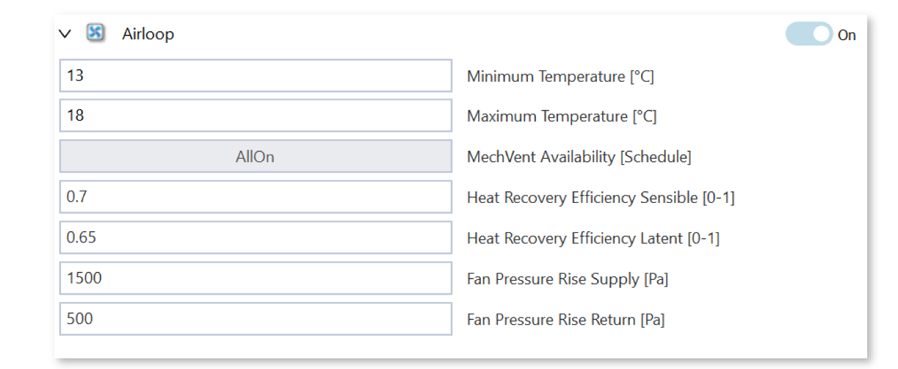
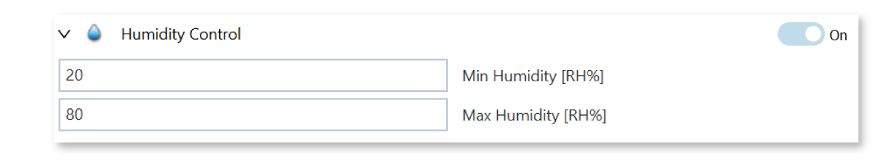

Full HVAC: Variable Air Volume (VAV) System
==================

The Variable Air Volume or VAV `system`_ is a common HVAC system in commercial buildings. 
It modulates the **volume of conditioned air delivered to different zones** to meet varying heating and cooling demands within the building. 
VAV systems can be more energy-efficient than systems using a constant air volume (CAV) by varying fan speed and air volume based on demand. 
It is configured as a centralized system with one **air handling unit** (AHU) (**14**) that manages the supply and return air loop within the AHU, heating, and cooling **coils** (**15**), and a **humidifier** (**16**) to condition the air stream. 
A **reheat coil** (**17**) in each zone provides additional control over temperature regulation and can help conserve energy. 
Even if the central system supplies cooler air, the reheat coil can warm it to meet the specific temperature requirements of a particular zone, ensuring occupant comfort. 

.. _system: thermal_system.html

The heating and cooling coils are connected to a hot and chilled water loop, respectively. These two loops are served by dedicated **heating** (**18**) and **cold-water plants** (**19**). ClimateStudio supports several system options that can greatly influence emissions and energy efficiency.

VAV Settings
------------------

VAV Heating Plant Options (**18**)
~~~~~~~~~~~~~~

The VAV heating plant supports a **Baseline Boiler**, **Condensing Boiler**, **Air Source Heat Pump**, 
and **Ground Source Heat Pump** configuration. 
The boiler supports different fuel sources that are linked with the model `emission factors`_. 
The heat pump options use electricity, and the electricity-related emission factors are applied.

.. _emission factors: emissionFactors.html 

Heating Plant Settings
^^^^^^^^^^^^^^^^^

Nominal COP or Efficiency
''''''''''''''''''''''''''''''''''''''''
The nominal Coefficient of Performance (COP) represents the efficiency of the system at a specific set of conditions, typically the rated conditions such as a standard outdoor temperature and load condition. The actual performance of the system may vary in different operating conditions (different temperatures, loads, etc.). The simulation uses standard performance curves to adjust the nominal COP to reflect actual operating conditions. For instance, if the operating temperature is different from the rated temperature, the capacity and energy input will be adjusted using the appropriate curves, leading to a different COP. Hence the actual :math:`COP = \mathit{Nominal\ COP} * \mathit{adjustments\ from\ curves}`.

Pump head
''''''''''''''''''''''''''''''''''''''''
The pump head in a building is a measure of the pressure that a pump needs to overcome to circulate fluid (typically water) through the HVAC or plumbing system. It is typically calculated in meters of fluid column (m) or converted to Pascals (Pa) using the relationship between pressure, fluid density, and gravity. To estimate the pump head we need to sum of all the pressure losses in the system, including the elevation head, frictional head loss, and any additional pressure required by the system.

.. math::
   TDH=H_\mathit{static} +H_\mathit{friction}+H_\mathit{pressure}

Where:
	:math:`H_\mathit{static}` : Static head describes the difference in height between the pump and the highest point in the system.  

	:math:`H_\mathit{friction}` : Frictional head loss due to the resistance of pipes, fittings, valves.  

	:math:`H_\mathit{pressure}` : Additional head required to maintain the desired pressure in the system.

The total dynamic head in meters of fluid can be converted to Pascals using the following formula:

.. math::
   Pressure(Pa)=ρ⋅g⋅\text{TDH}

Where:
   :math:`p` : Density of water ≈ 1000 kg/m3

   :math:`g` : Acceleration due to gravity ≈ 9.81 m/s2g

   :math:`\text{TDH}` : Total Dynamic Head (in meters)

Assuming a frictionless system that does not operate at a high pressure the pump head could be estimated by simply estimating the height difference within the system. Assuming an 18m heigh building an approximate pressure rise would be 18*1000*9.81 ≈ 176,400Pa

VAV Cooling Plant Options (**19**):
~~~~~~~~~~~~~~
The VAV cooling plant supports offers and **Air Cooled Chiller**, two **Water Cooled Chillers**, **Air Source Heat Pump**, and **Ground Source Heat Pump** configuration.

Air-cooled chillers use air to dissipate the heat absorbed from the building's cooling system. These chillers are typically installed outdoors and use fans to blow air across a condenser coil to remove heat. The benefits of using an air-cooled chiller are that it is simpler and less expensive to install and has lower maintenance costs compared to water-cooled chillers. Tradeoffs are lower efficiency compared to water-cooled chillers, especially in hot climates, and their performance can be affected by high ambient temperatures. 

Water-cooled chillers reject heat to water instead of air. These systems require a cooling tower to dissipate heat to the atmosphere. This setup offers higher efficiency, especially in large-scale cooling applications in hot climates.

Similar to the air-cooled chiller, Air source heat pumps (ASHPs) work by absorbing heat from the indoor air and releasing it into the outdoor environment. A key benefit of using ASHP over an air-cooled chiller is that the same system can run in reverse mode to provide heating. Ground-source heat pumps (GSHPs), also known as geothermal heat pumps, utilize the relatively stable temperature of the ground to provide cooling (and heating). These systems are more efficient than air-source heat pumps because ground temperatures are more stable year-round. Ground source systems are typically more expensive to install due to the need for ground loops and excavation work.

VAV Air Loop Controls
~~~~~~~~~~~~~~

   

Minimum and Maximum Temperature Setpoints
^^^^^^^^^^^^^^^^^
The min and max temperatures define the upper and lower temperature bounds in which the air loop operates. If return or outdoor air introduced into the supply airstream pushes the temperature outside these bounds, the heating and cooling coils will add or remove heat to meet the setpoint regime.

Fan Pressure Rise
^^^^^^^^^^^^^^^^^
The fan pressure rise (:math:`ΔP`) for supply and return fans in a building is the difference between the total pressure on the discharge side and the total pressure on the suction side of the fan. This pressure rise is a key factor in determining the fan's ability to overcome the resistance in the ductwork and deliver the required airflow.

|

Back to `System`_. 

.. _System: thermal_system.html