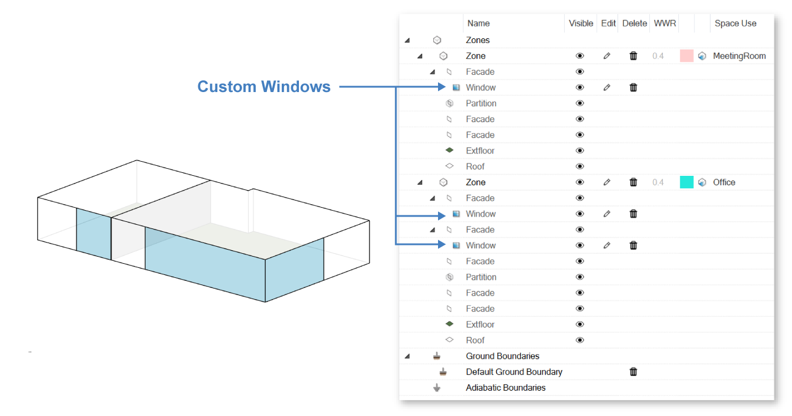
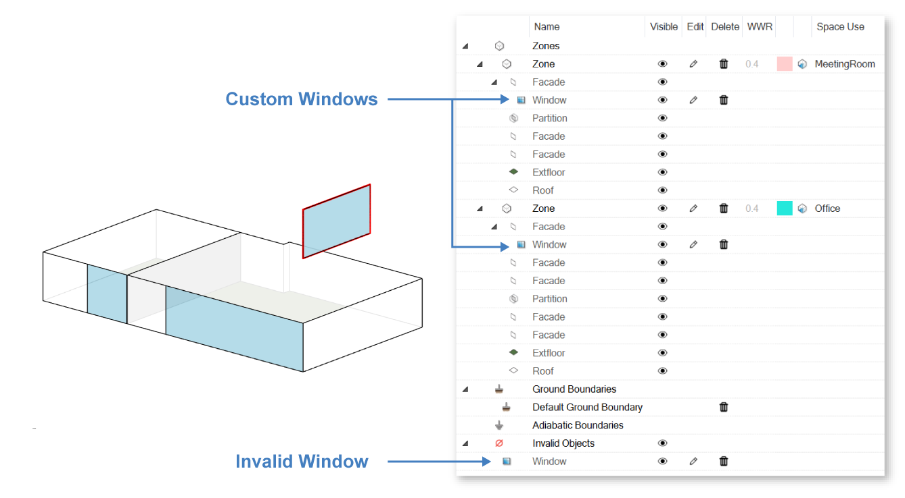

Windows
================================================

Any type of envelope opening such as windows or skylights are models as flat surfaces with three or four corner points. Window surfaces have to be completely embedded in a zone surface to be recognized as a child object of a zone wall or roof. 

Note: 
	While window surfaces in EnergyPlus may not touch the edge of a zone surface, you may draw a window in ClimateStudio by just snapping to the corner points of a wall. ClimateStudio will then slightly offset the corner of the window from the wall surface.     

Once all windows have been selected, the Windows dialogue appears. 

.. figure:: images/addObjects7.png
   :width: 900px
   :align: center

- **Glazing Material:** ClimateStudio comes with a large selection of actual glazing units that can be selected via the glazing construction dialogue. The input data for these glazing units are based on measurements stored in the `International Glazing Database (IGDB).`_ The glazing construction panel supports sorting the glazing units in the ClimateStudio database by, for example, visual light transmittance or solar heat gain coefficient. Once a glazing is selected, its main elements, such as individual glass panes and any fillings between the panes is displayed above.

  .. _International Glazing Database (IGDB).: https://windows.lbl.gov/software/igdb

  .. figure:: images/glazingConstruction.png
   :width: 900px
   :align: center

- **Shading System Settings:** Dynamic shading systems can be modeled by setting a shading plus shading control. The schedule determines when the control is being activated throughout the year. 

- **Ventilation Settings:** the user can specify whether a window is operable for natural ventilation purposes, the fraction of the window area that is operable and at what indoor zone temperature the window will be opened. 

- **Window Frame:** By default, EnergyPlus assumes that the thermal properties of a glazing unit extend across the rough opening of the window. To consider the thermal properties of a frame, its outer frame width and U value can be set to account for heat losses across the frame.

Once window surfaces have been selected, they are added to the thermal model table and are previewed in the Rhino viewport (when in Wireframe display mode). If the window geometry is valid and is placed on a zone face, it will appear as a child object of that surface in the zone table.

If the window geometry cannot be assigned to a zone-surface, it will be considered to be an invalid object and will be outlined in red. 

