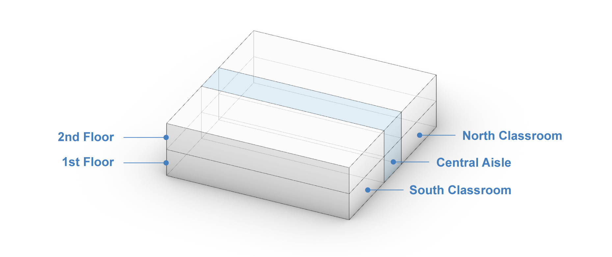
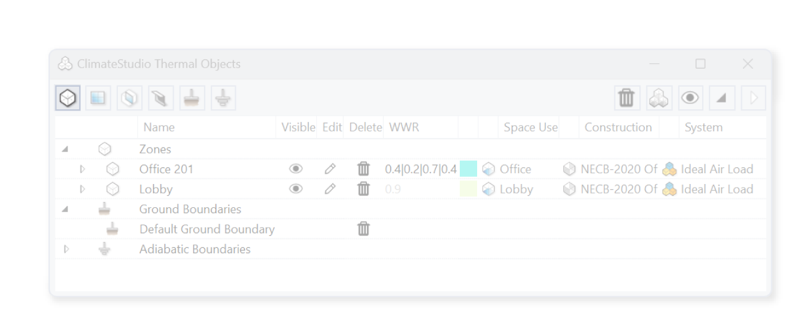
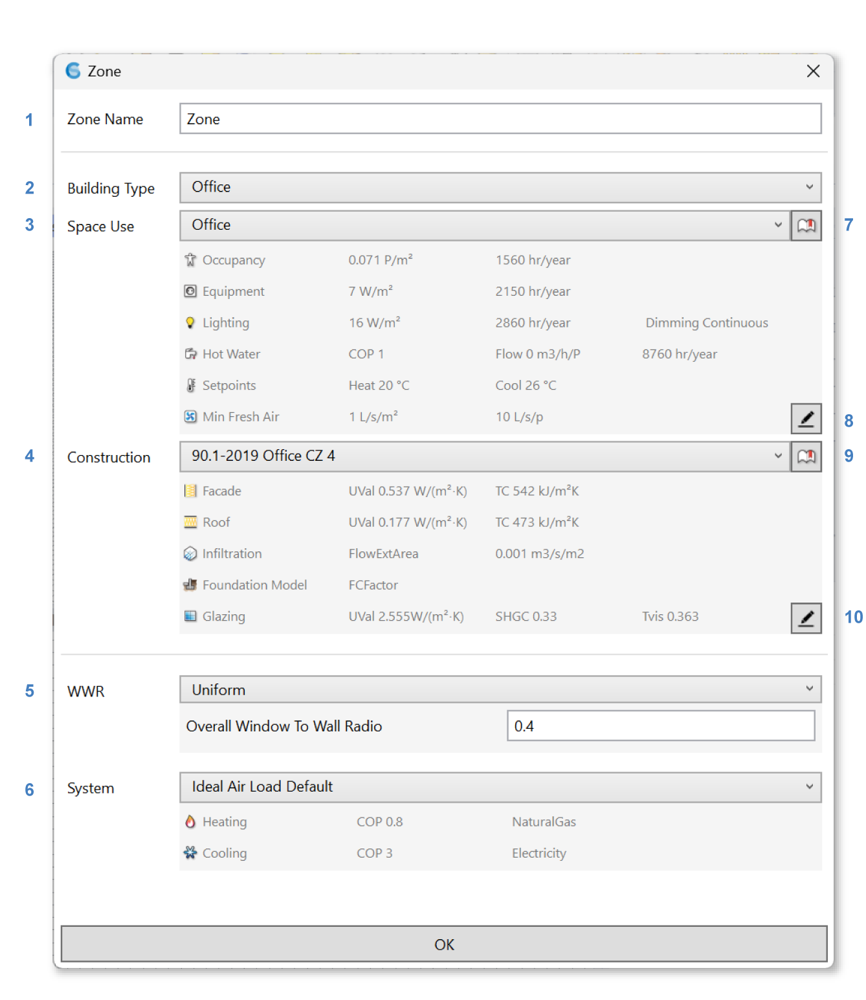
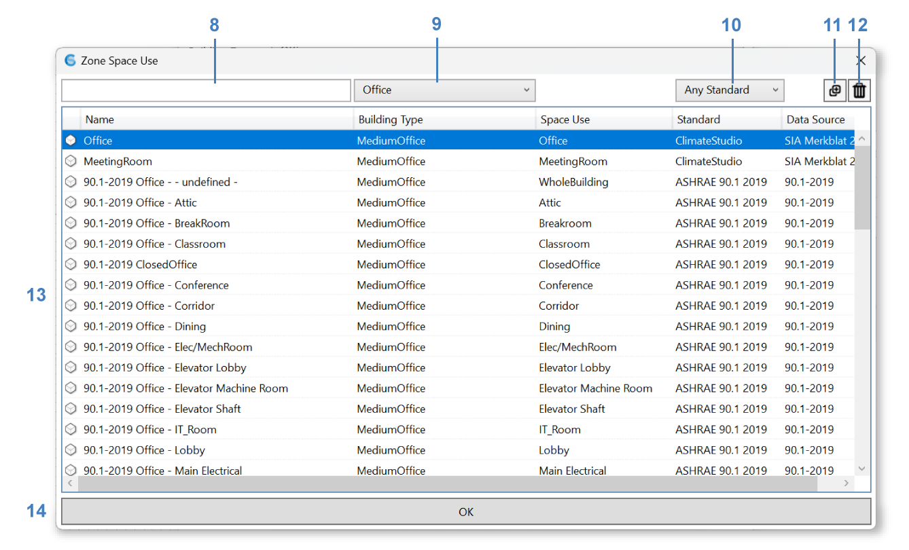
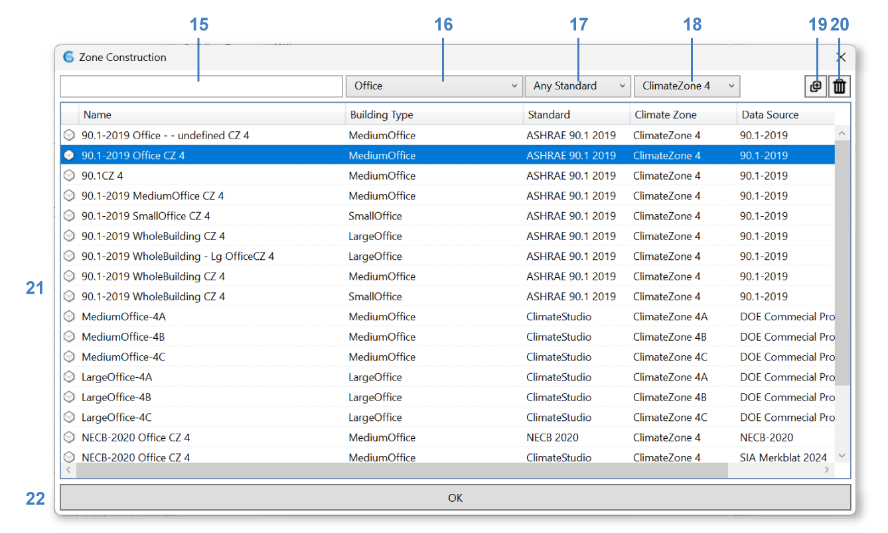
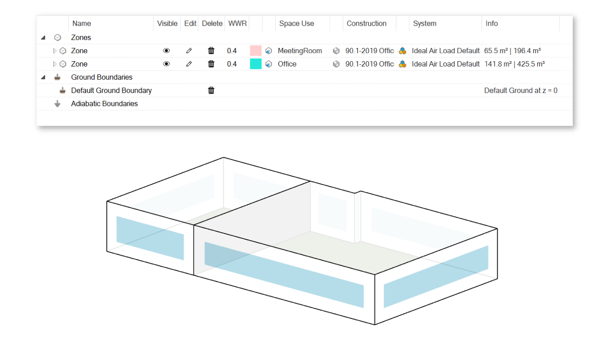

Zone
================================================

Thermal zones are modeled as **closed boundary representations** (Breps) in Rhino. 
Thermal zones are the fundamental building blocks of `thermal simulations`_. 
They describe spaces within a building that are conditioned to the same temperature, 
have the same programmatic use (such as office or classroom) and experience comparable loads from solar radiation, etc. 
A thermal zone may be thought of as a room. 

.. _thermal simulations: thermalAnalysis.html

However, in some cases, modelers may want to simplify the energy model and **lump together multiple rooms** 
if they have identical loads and may be served by the same HVAC system. 
A row of identical, south-facing classrooms can be treated as a single zone since there will be no marginal heat flow between the classrooms 
if they are used in the same way. 

On the other hand, a large open office area should be divided into **perimeter zones** bordering the building envelope with a depth of around 5m (15 feet) 
and a core zone (see below). 
Combining core and perimeter zones into a single zone leads to an under prediction of conditioning loads since a surplus of solar gains 
in one zone may be credited to the heating required in another. 
In reality, local cooling and heating may be required simultaneously. 

.. figure:: images/addObjects2.png
   :width: 400px
   :align: center

Spaces on different floors should also not be combined into a single zone because ClimateStudio identifies downward facing surfaces as floors and assigns internal loads for equipment and occupants by floor area. Combining two floors into a single zone thus halves those loads.

The figure below shows an example zoning model of a two-story wing with bands of classrooms bordering a central circulation area. The whole wing should be modeled as six zones, with North and South facing classrooms on both floors and a core zone for the aisle.

Neighboring zones must be modeled carefully so their surfaces touch. This is so that EnergyPlus understands that two zones are touching and any areas between them are hence interior.

Creating or Editing Thermal Zone(s)
-----------------------------

Once one or several Breps have been selected as thermal zones, 
click on the **Create Thermal Zone Button** above the Thermal Model Table to create a Thermal Zone. 
A **Zone dialogue** appears: 

Change the **Zone Name** (**1**) in the text box (optional). 

Building Type
~~~~~~~~~~~~~

ClimateStudio comes with a large selection of predefined space use and construction templates derived from the US Department of Energy (DOE) Commercial `Prototype Building models.`_ 
These templates are descriptions of typical commercial US buildings located in different ASHRAE climate zones.    

.. _Prototype Building models.: https://www.energy.gov/eere/slsc/building-energy-use-benchmarking

.. figure:: images/addObjects5.png
   :width: 900px
   :align: center

Choose a **Building Type** (**2**) between Cultural, Dining, Education, Healthcare, Hospitality, Logistics, Office, Other, Public Service, Residential, and Retail to help narrow down the predefined templates. 
This will update the templates available to choose from in the **Space Use dropdown** (**3**) and the **Construction dropdown** (**4**). 

.. _Thermal Zone Settings: thermalZoneSettings.html

Space Use
^^^^^^^^
Choose a space-use template from the selected **Building Type** from the dropdown (**4**). 
Alternatively click on the library button (**9**) to see more options: 

.. _weather: location.html

**Search** (**8**) for a template directly or narrow down the selection with the **building type** dropdown (**9**) 
or the **standards** dropdown (**10**). 
You may also **copy** (**11**) an existing template or **delete** (**12**) a custom template. 
Click on any item in the space use template library table (**13**) to choose a template 
and click OK (**14**) to confirm the selection; this will bring you back to the **Zone dialog**. 

The grey area under the space use dropdown (**3**) shows a summary of the current selected template. 
Click on the edit template button (**8**) to further edit the specific `Thermal Zone Settings`_ (optional). 

.. _Thermal Zone Settings: thermalZoneSettings.html

Construction
^^^^^^^^

Choose a construction template from the selected **Building Type**  and the current **Climate Zone** 
(based on the `weather`_ file) from the dropdown (**3**). 
Alternatively click on the library button (**7**) to see more options: 

**Search** (**15**) for a template directly or narrow down the selection with the **building type** dropdown (**16**), 
the **standards** dropdown (**17**), and the **climate zone** dropdown (**18**). 
You may also **copy** (**19**) an existing template or **delete** (**20**) a custom template. 
Click on any item in the construction template library table (**21**) to choose a template 
and click OK (**22**) to confirm selection; this will bring you back to the **Zone dialog**. 

The grey area under the construction dropdown (**4**) shows a summary of the current selected template. 
Click on the edit template button (**10**) to further edit the specific `Thermal Zone Settings`_ (optional). 

The window construction in the template is climate appropriate. However, it will only be applied to auto-generated windows. Custom `windows`_ have their own settings. 

.. _windows: thermal_window.html

Window-to-Wall Ratio (WWR) 
~~~~~~~~~~~~~

A **uniform** (**5**) or **directional** window-to-wall ratio can be selected for this zone's auto-generated window 
(if there are no custom windows present). More details see `thermal model table`_. 

.. _thermal model table: thermalModel.html#thermal-model-table

System
~~~~~~~~~~~~~
Choose a `system`_ (**6**) from the dropdown. 
Key parameters of the selected system are shown in the grey info box below the dropdown. 

.. _system: thermal_system.html

| 

Click OK to create/edit the thermal zone. 

Once a zone template has been assigned, the zones appear in the `thermal model table`_ and are previewed in the Rhino viewport. The image below shows a two-zone model representing the conference room and open office in the `ClimateStudio example file.`_

.. _ClimateStudio example file.: https://climatestudiodocs.com/ExampleFiles/CS_Two_Zone_Office.3dm

|
Back to `Thermal Model`_. 

.. _Thermal Model: thermalModel.html