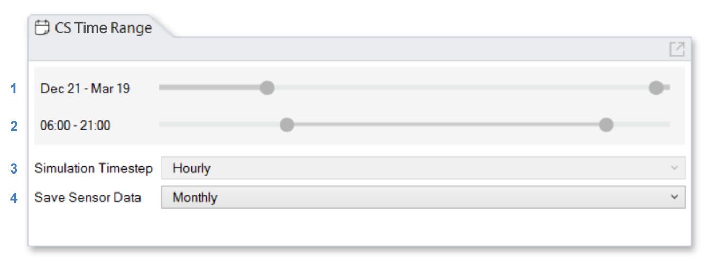

Time Range
================================================
The Time Range panel is used to specify the resolution and extent of a `radiation map`_ simulation. 

   

| 1 - Use the **Date Range Slider** to select dates (inclusive and wraps around)
| 2 - Use the **Time Range Slider** to select hours (inclusive and wraps around)
| 3 - The **Simulation Timestep** is always hourly
| 4 - The **Saved Sensor Data** can be monthly to save disc space or hourly to show fine grained result. 

*Both the date range slider and the time range slider can be fine-tuned with the left and right arrow keys on the keyboard.* 

.. _radiation map: radiationMap.html