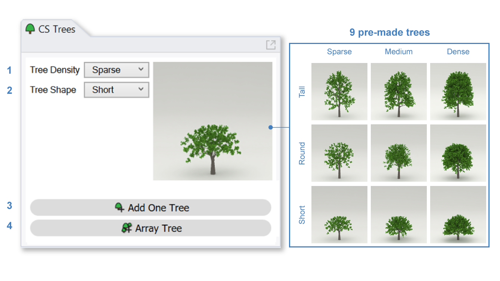
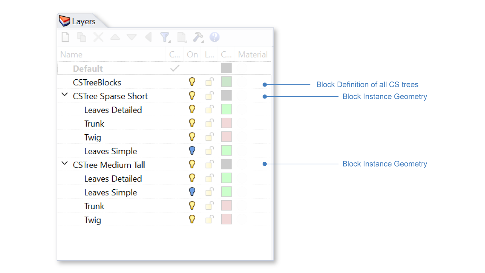
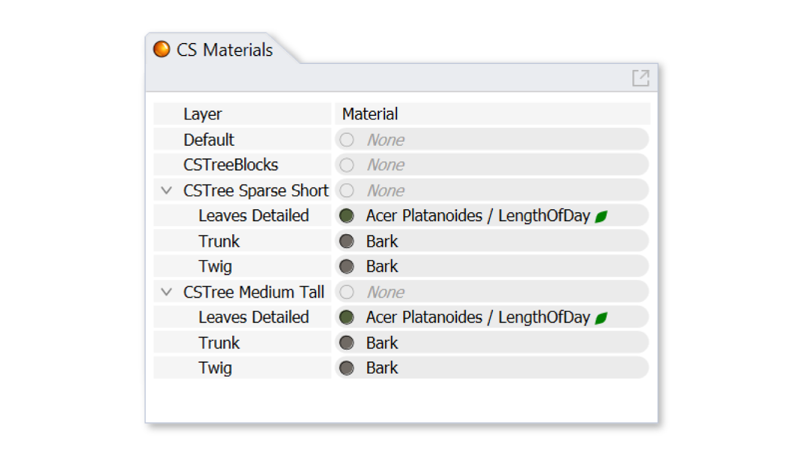

Trees
================================================
As of v2.0, the Tree Panel provides a collection of tree geometries that can be placed in the Rhino document as block instances. The blocks are populated with ClimateStudio materials, including a `dynamic leaf`_ material -- which makes the tree behave as a **deciduous** species. I.e., its foliage disappears and changes color depending on the latitude and time of year, in both `point-in-time`_ and `annual`_ simulations. To make the tree behave as an **evergreen** species instead, you can edit its materials after placing the block.

   

The trees span a range of canopy densities and shapes (aspect ratios), which are selectable via the panel's two dropdowns: 

| 1 - **Tree density**

  - Sparse

  - Medium
  
  - Dense

| 2 - **Tree Shape**

  - Short

  - Round

  - Tall

Add One Tree
<<<<<<<<<<<<<<<<<<<<<<<<<<<<<<<
Once a tree type is selected, you can add a single instance to the document using the **Add One Tree** button (3). You will be prompted to place the tree in the viewport. Once placed, the tree can be moved, resized, or copied / arrayed to create multiple instances.

Array Tree
<<<<<<<<<<<<<<<<<<<<<<<<<<<<<<<
If you wish to automate the arrangement of multiple tree instances in advance, you can use the **Array Tree** button (4). To use this feature, first create points where trees should be located. If you wish to specify the size of tree instances in advance, use circles instead of points -- with the diameter indicating the size of the canopy.

Once you have set up anchor geometries, click the **Array Tree** button (4). The Rhino command line will prompt you to select the points and/or circles of interest. It will then ask if size and/or rotational jitter should be applied to the tree instances. 

- Rotational jitter will give each instance a random rotation about its anchor point. 

- Size jitter will adjust the size of each instance, to give a sense of natural variation. This option applies only to instances with point anchors. 

After selecting the jitter option, trees are placed in the Rhino model as block instances. As when placing a single instance, these can be moved, resized, or copied after the fact.

Block Definitions and Instances
<<<<<<<<<<<<<<<<<<<<<<<<<<<<<<<
Every time the **Add One Tree** or **Array Tree** button is pressed, a new **block definition** is created. The definition has a layer structure named after the type of tree, e.g. *CSTree Sparse Short*, and its geometry exists on sublayers, e.g. *Trunk* or *Leaves Detailed*. These sub-layers can be turned on/off or given new materials, just like any Rhino layer. **Instances** of these definitions are placed on the *CSTreeBlocks* layer. Turning off this layer will hide all CS trees placed in the Rhino document. Turning off the *CSTree Sparse Short* layer, on the other hand, will hide only CSTrees that are sparse and short. 

   

Tree instances can be copied, scaled, moved, and rotated around the scene. Copies will create additional instances of the block definition, with minimal impact on the Rhino document's size. 

Editing Trees
<<<<<<<<<<<<<<<<<<<<<<<<<<<<<<<
Since tree geometries are pre-compiled for faster loading in Radiance scenes, we don't recommend editing the trees beyond translation, rotation, and proportional scaling. ClimateStudio will show an error message and undo any edits that violate transform similarity (e.g. reflection). 

Trees can be edited by exploding or editing the block definitions placed by ClimateStudio, but this will bypass Radiance instancing, leading to longer simulation load times. 

Materials
<<<<<<<<<<<<<<<<<<<<<<<<<<<<<<<
The leaf layers are pre-applied with ClimateStudio's `dynamic leaf`_ material, which mimics the behavior of deciduous foliage. Changing the material to a (static) **opaque** type will cause the leaves to always be present, as in an evergreen species. Block definition material layers can be edited in `materials panel`_ just like any other Rhino layer. 

.. _Dynamic Leaf: materials_dynamicLeaf.html
.. _Materials Panel: materials.html
.. _annual: materials.html#dynamic-materials
.. _point-in-time: materials.html#dynamic-materials
.. _below:tree.html#materials