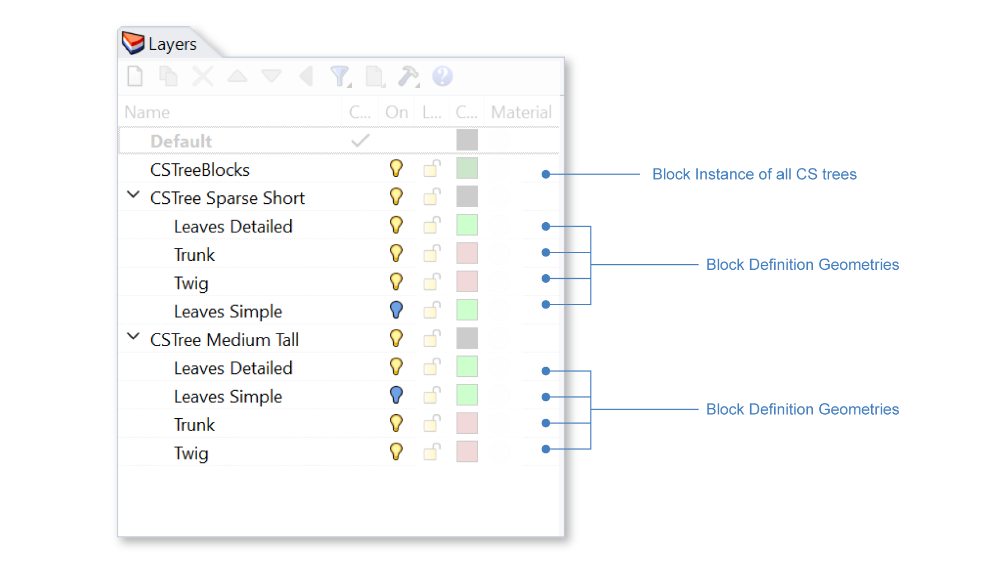

Trees
================================================
ClimateStudio v2.0 comes with a set of 9 pre-made trees that can be placed into the model. These trees are pre-processed for our `radiance render engine`_. 

The Tree Panel is used to place the pre-made trees, either individually or in groups. 

   

Use the two dropdown menus to switch between the 9 trees: 

| 1 - **Tree density**

  - Sparse

  - Medium
  
  - Dense

| 2 - **Tree Shape**

  - Short

  - Round

  - Tall

Add One Tree
<<<<<<<<<<<<<<<<<<<<<<<<<<<<<<<
Click on the **Add One Tree** button (3) to add a single tree instance with a diameter of 10 meters to the model. 

Add Multiple Trees (multiple instances of the same tree)
<<<<<<<<<<<<<<<<<<<<<<<<<<<<<<<
To add multiple trees, first place points in the model where trees should be (place circles instead if the diameter of the tree crown have specific values).

Click on the **Array Tree** button (4) to add multiple trees. 

Rhino will prompt in the command line to select either points or circles to be the basis of arraying trees.

- Circle's diameter will be the tree crown's diameter. 

- If a point is provided the resulting tree is around 10 meters in diameter. 

Select points and/or circles. 

Rhino command line will ask if size and/or rotational jitter should be applied to the tree instance blocks. 

- Rotational jitter will rotate the trees placed randomly, creating a more natural look even though they are all instances of the same tree block. 

- Size jitter will scale these instances slightly randomly to create further variation. 

After selecting size and or rotational jitter, trees are placed into the Rhino model as block instances. 

Tree Block and Tree Block Instances
<<<<<<<<<<<<<<<<<<<<<<<<<<<<<<<
Every time the **Add One Tree** or the **Array Tree** button is pressed, a new block is added to "CSTreeBlocks" layer, 
and the geometries for leaf and trunk are placed in the sub-layer of a layer named with the density and shape of the tree. 
These sub-layers can be turned on and off just like any Rhino layer. 

   

Turning off the "CSTreeBlocks" layer will turn off all CS trees placed in the Rhino document. Turning off the "CSTree Sparse Short" layer will turn off all CSTrees that are sparse and short. 

Tree blocks can be copied, scaled, moved, and rotated around the scene. These will all be created as additional instances of the block (same as the **Array Tree** button) and will not increase the Rhino file's footprint significantly. 

Editing Trees
<<<<<<<<<<<<<<<<<<<<<<<<<<<<<<<
Since threes are pre-processed for our radiance workflow we don't recommend editing the trees beyond translation, rotation, and proportional scaling. ClimateStudio will show an error message and undo any edits that is not a similarity transform (reflection not allowed). 

Trees can be edited by exploding the blocks placed by Climate Studio, but this will cause the simulations to run slower as our optimizations cannot apply. 

Materials
<<<<<<<<<<<<<<<<<<<<<<<<<<<<<<<
The leaves layers are pre-applied with ClimateStudio's `dynamic leaf material`_. 

.. figure:: images/subPanel_trees_material.png
   :width: 900px
   :align: center

The material of the leaves or tree trunk layer can be edited in `materials panel`_ just like any other Rhino layer. 

.. _radiance render engine: radianceRender.html
.. _dynamic leaf material: materials_dynamicLeaf.html
.. _materials panel: materials.html