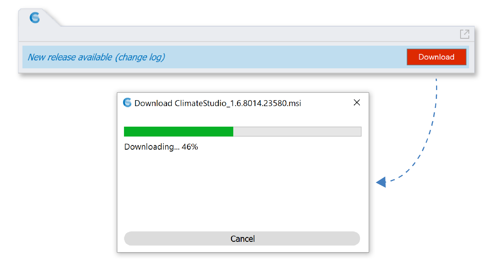
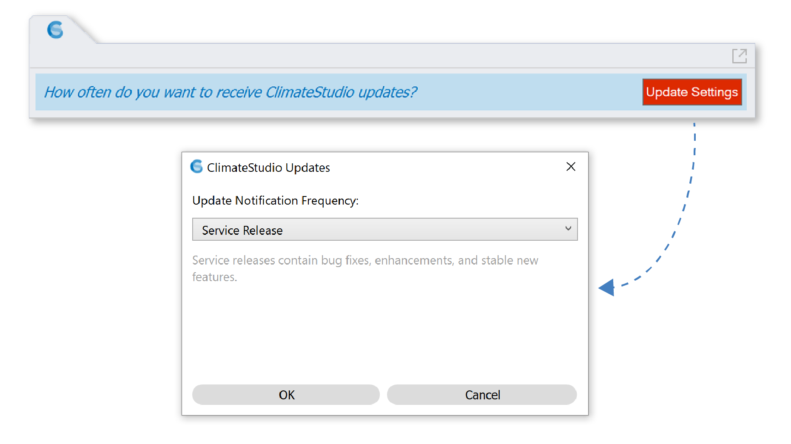
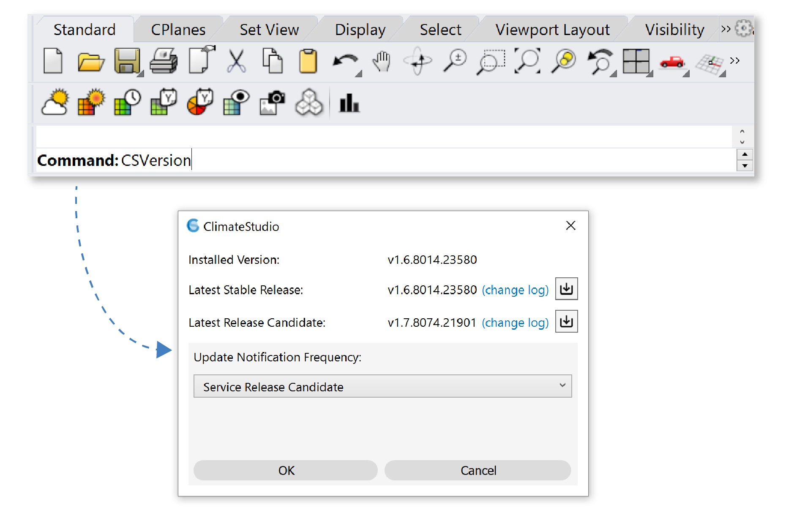

Version Updates
================================================
As a subscription software, ClimateStudio is continuously improving. We strongly recommend staying up to date with the latest features and fixes by installing updates as they become available. When a new ClimateStudio version is posted, a notification will appear at the top of the Workflows panel. Click **Download** to retrieve and run the installer.

The first time the notification appears, you will be asked how often you want to receive updates. By default, you will be notified only when a full Service Release is available. If you want early access to fixes and work-in-progress features before their official release, you can select the **Service Release Candidate** option.

To change this setting at any time, simply type "**CSVersion**" at the Rhino command line. In addition to letting you set the update frequency, the resulting dialog reports the currently installed version, and provides download links to the latest installers and change logs.

