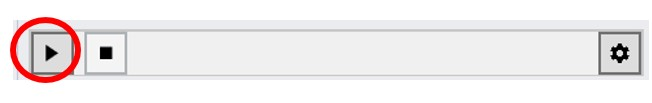

View Analysis
================================================
This workflow assesses occupant views and computes eligibilty for the LEED v4 Quality Views credit.

.. figure:: images/workflowPanel_view.png
   :width: 900px
   :align: center

The workflow relies on two subpanels: 

- `Assign Materials`_

- `Add Areas`_

.. _Assign Materials: assignMaterials.html

.. _Add Areas: addAreas.html

When assigning materials, it is critical that you append the **VisionGlass** tag to layers that represent exterior vision glazing. Although the materials in the left column control the optical behavior of surfaces in the model (and hence what can be seen from any vantage), a separate tag in the right column is required to distinguish the "vision glazing," because it is specifically through these surfaces that views and view distances are measured.
 
*[material table image]*

If you have not done any lighting simulations in ClimateStudio, it is recommended that you initially go through the `Lighting Model Setup`_ video tutorial (5 minutes). 
The Rhino file used in the tutorial is available for `download`_.

.. _Lighting Model Setup: https://vimeo.com/392379928 
.. _download: https://climatestudiodocs.com/ExampleFiles/CS_Two_Zone_Office.3dm
 

Once all required input subpanels have been populated, a simulation is invoked by pressing the start button. 

   
LEED v4 Quality Views
----------------------------------------------------
The USGBC awards up to 1 point for Quality Views under the Indoor Environmental Quality Credit (up to 2 points for Healthcare projects). To qualify, 75% of the regularly occupied floor area must have at least two of the following view types:

- **1. Multiple lines of sight** to vision glazing in directions at least 90 degrees apart.
- **2. Context and sky** views that include at least two of the following: (1) vegetation or sky, (2) movement, (3) objects at least 25 feet from glazing.
- **3. Unobstructed** views from within three times the vision glass head hight.

The USGBC also specifies a fourth type of view that is *not* assessed by ClimateStudio, involving angular factors defined in *Windows and Offices: A Study of Office Worker Performance and the Indoor Environment*.

View Factors
----------------------------------------------------
In addition to computing LEED credits, the View Analysis workflow reports 

Simulation Results
--------------------
TODO...

Reporting
-----------
TODO...

