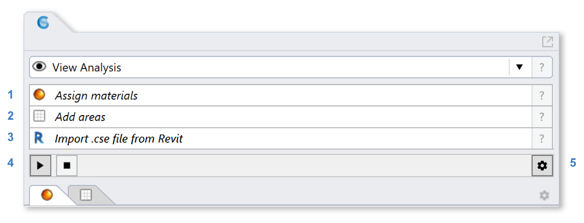
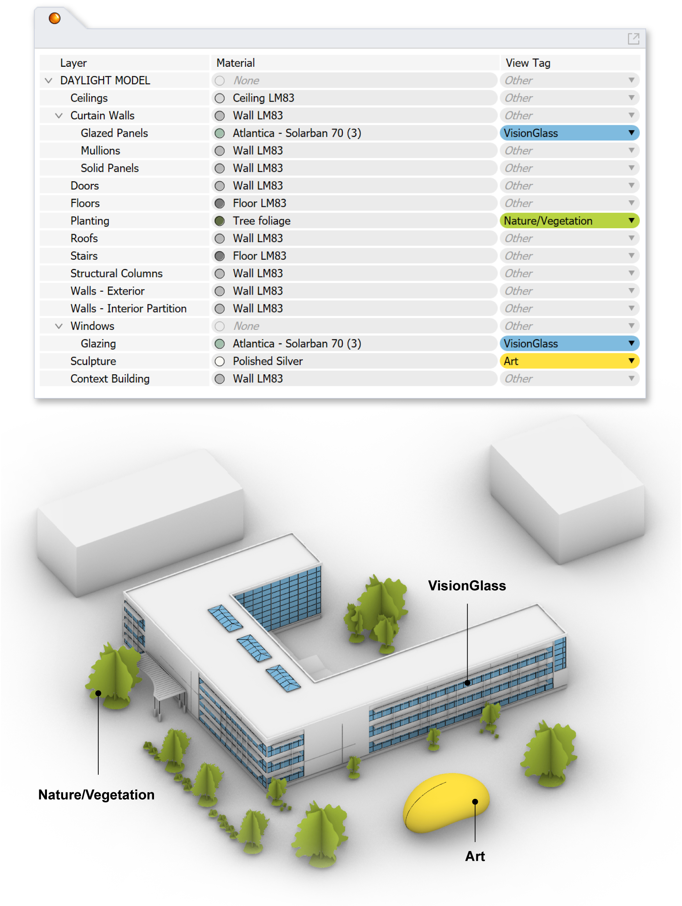
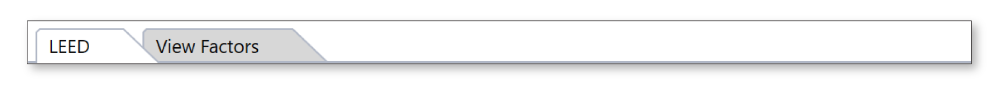

View Analysis
================================================
This workflow assesses occupant views and computes eligibilty for the LEED v4 Quality Views credit. It can also be used to calculate view factors and view distances to specific model layers or objects of interest.

Simulation Setup
--------------------

To prepare a model for simulation, work you way though the materials and occupied-areas subpanels, labeled 1 and 2 in the figure above. 

| 1 - `Materials`_
| 2 - `Occupied Areas`_ 

.. _Materials: assignMaterials.html

.. _Occupied Areas: addAreas.html

When assigning materials, a **VisionGlass** tag must be attached to layers that represent exterior vision glazing. Although the materials specified in the Material column control the optical behavior of surfaces in the model (and hence what can be seen from any vantage), a separate View Tag is required to distinguish the "vision glazing," because it is specifically through these surfaces that views and view distances are measured.
 

If you are submitting for LEED certification, you may also wish to organize and tag model layers containing features of visual interest, including *nature*, streetscapes busy with *movement* (LEED v4.0), and *art* or *urban landmarks* (LEED v4.1).

If you have not done any lighting simulations in ClimateStudio, it is recommended that you initially go through the `Lighting Model Setup`_ video tutorial (5 minutes). 
The Rhino file used in the tutorial is available for `download`_.

.. _Lighting Model Setup: https://vimeo.com/392379928 
.. _download: https://climatestudiodocs.com/ExampleFiles/CS_Two_Zone_Office.3dm
 

Once all required inputs have been populated, a simulation is invoked by pressing the start button (3). The number of CPU cores used can be adjusted via the settings dialog (4).
 
Simulation Results
--------------------
The View Analysis workflow performs multiple types of view assessment. When the calculation is finished, or when a saved result is loaded, the `results panel`_ will show a summary with two tabs. Use the links below to skip ahead to the option of interest.

.. _results panel: results.html

.. toctree::
   :maxdepth: 1
   
   LEED<viewLEED.rst>
   View Factors<viewFactors.rst>

