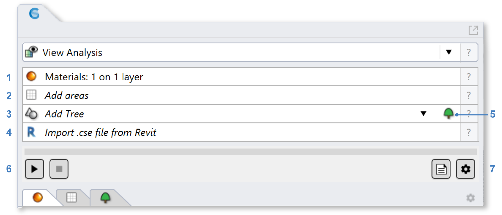
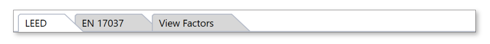
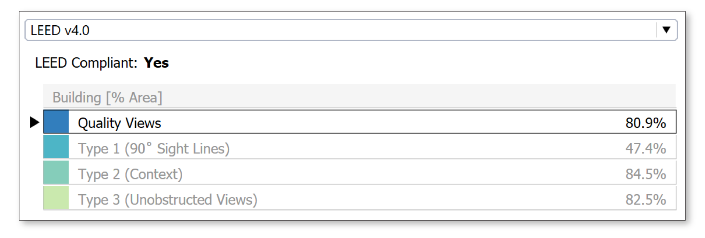
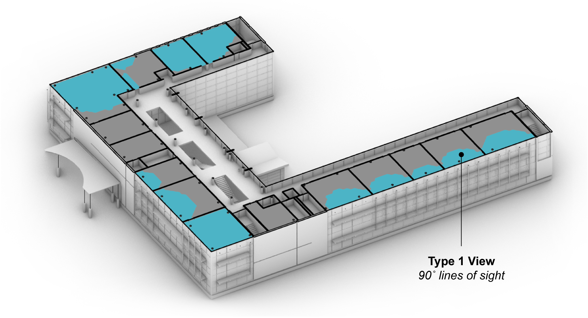
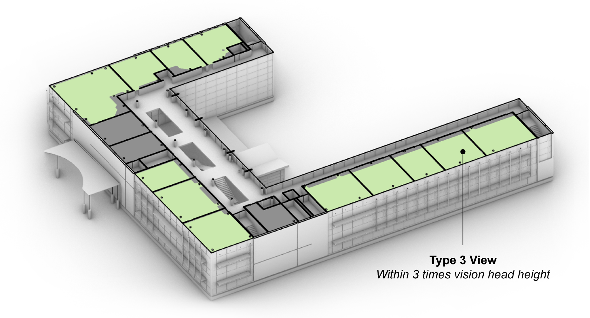
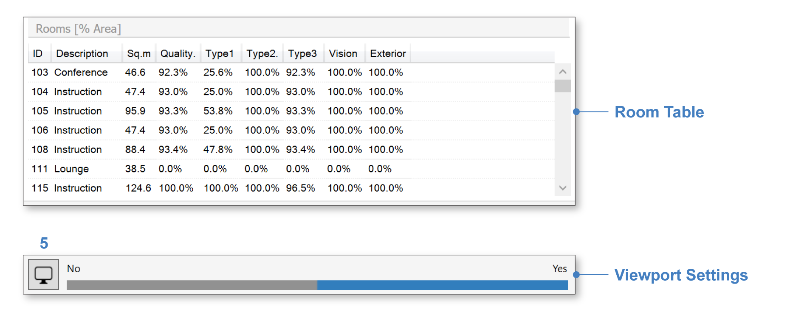

View Analysis
================================================
This workflow assesses occupant views and computes eligibilty for the LEED v4 Quality Views credit. It can also be used to calculate view factors and view distances to specific model layers or objects of interest.

Simulation Setup
--------------------

To prepare a model for simulation, work you way though the materials and occupied-areas subpanels, labeled 1 and 2 in the figure above. 

| 1 - `Materials`_
| 2 - `Occupied Areas`_ 

.. _Materials: assignMaterials.html

.. _Occupied Areas: addAreas.html

When assigning materials, a **VisionGlass** tag must be attached to layers that represent exterior vision glazing. Although the materials specified in the Material column control the optical behavior of surfaces in the model (and hence what can be seen from any vantage), a separate View Tag is required to distinguish the "vision glazing," because it is specifically through these surfaces that views and view distances are measured.
 
.. figure:: images/result_viewSetup.png
   :width: 900px
   :align: center

If you are submitting for LEED certification, you may also wish to organize and tag model layers containing features of visual interest, including *nature*, streetscapes busy with *movement* (LEED v4.0), and *art* or *urban landmarks* (LEED v4.1).

If you have not done any lighting simulations in ClimateStudio, it is recommended that you initially go through the `Lighting Model Setup`_ video tutorial (5 minutes). 
The Rhino file used in the tutorial is available for `download`_.

.. _Lighting Model Setup: https://vimeo.com/392379928 
.. _download: https://climatestudiodocs.com/ExampleFiles/CS_Two_Zone_Office.3dm
 

Once all required inputs have been populated, a simulation is invoked by pressing the start button (3). The number of CPU cores used can be adjusted via the settings dialog (4).
 
Simulation Results
--------------------
When the calculation is finished, or upon loading a saved result, the `results panel`_ will show an outputs summary with two tabs:

.. _results panel: results.html

   
LEED
^^^^^^^^^^^^^^^^^^^^^^^^^^^
The LEED tab reports eligibility for the LEED v4 Quality Views credit. This is an Indoor Environmental Quality credit within the Leadership in Energy and Environmental Design (`LEED`_) green building rating system, maintained by the US Green Building Council (`USGBC`_). At the top of the LEED v4 tab is a dropdown offerering two versions of the Quality Views credit (4.0 and 4.1), followed by a dashboard with up to four metrics, which correspond to four types of view:

.. _LEED: https://www.usgbc.org/leed
.. _USGBC: https://www.usgbc.org/

   
The value listed next to each metric is the percentage of the regularly occupied building floor area possessing a view of the given type. The types are defined as follows:
   
- **Quaity Views**: The definition of a Quality View differs beetween LEED versions 4.0 and 4.1. In version 4.0, a Quality View is a location possessing two of the three view types that follow (Types 1-3). In version 4.1, a Quality View is a location possessing *both* Type 2 and Type 3 views (Type 1 is not considered). To qualify for a credit, at least 75% of the regularly occupied building floor area must have a Quailty View. For each view type, clicking on the dashborad row displays a map of qualfying view locations in the Rhino viewport:
   
.. figure:: images/result_viewportViewQuality.png
   :width: 900px
   :align: center

- **Type 1: Multiple lines of sight**: A view location with multiple lines of sight to vision glazing at least 90 degrees apart. This type is considered only in LEED v4.0. 
   

- **Type 2: Context and sky**: The definition of a Type 2 view differs between LEED versions 4.0 and 4.1. In version 4.0, a Type 2 view includes at least *two* of the following: (1) vegetation / sky, (2) movement, and (3) objects at least 25 feet from glazing. In version 4.1, a Type 2 view includes at least *one* of the following: (1) nature / art / urban landmarks, or (2) objects at least 25 feet from glazing.

.. figure:: images/result_viewportViewType2.png
   :width: 900px
   :align: center

- **Type 3: Unobstructed**: A view location with a line of sight to vision glazing from within three times its head hight.

LEED v4.0 also specifies a fourth type of view that is *not* assessed by ClimateStudio, involving angular factors defined in *Windows and Offices: A Study of Office Worker Performance and the Indoor Environment*. Below the dashoard is the Room Table, which lists view type percentages for each regularly occupied floor area, and a Viewport Settings bar, which contains a legend and settings button (5) for adjusting the display:

View Factors
^^^^^^^^^^^^^^^^^^^^^^^^^^^
The View Factors tab reports view factors for each view tag and model layer. These are listed in a dropdown at the top of the tab:

Selecting a layer or tag (in this case, the "Art" tag) reveals the corresponding view factors in the Rhino viewport:

The **view factor** at a particular location is measured as the percentage of view (by solid angle) occupied by the given feature. The field of view is 360 degrees horizontally, and 60 degrees vertically, centered on the horizon. The *subject* of a given pixel is taken to be the first opaque object that the view ray intersects, *or* the first object of any kind that the ray strikes *after* passing through vision glass (whichever comes first). In other words, view rays will pass through interior glass doors and partitions, but will stop when they encounter a glass facade across the street.

Below the feature dropdown and summary is the Room Table, which lists room-by-room view factors all tags and layers in the model, and a Viewport Settings bar, which contains a legend and settings button (6) for adjusting the display:

Reporting
-----------
TODO...

