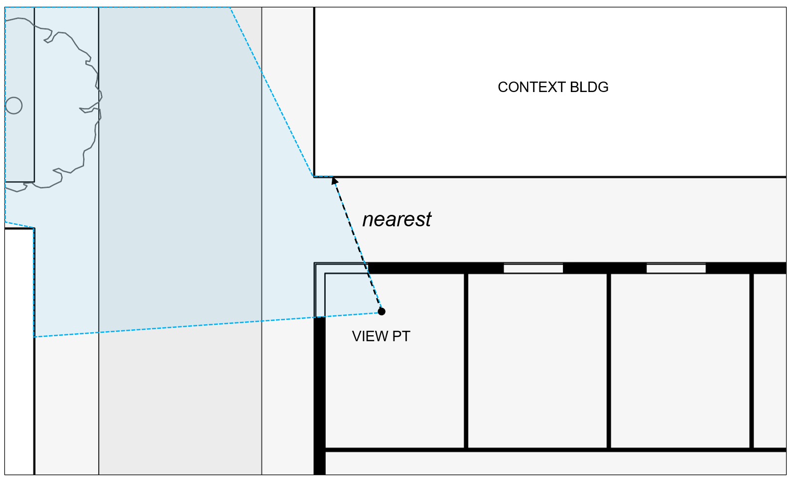

Outside Distance of View
=========================
When assessing views, both LEED and the EN 17037 standard consider the distance between objects and the window. Although both rating systems describe distances that must be achieved for compliance, neither provides a detailed explanation of *how* distances should be measured. As a result, the practice has been subject to interpretation. Some readers have assumed distances along lines of sight, while others have assumed distances normal to the window. Complicating the picture further is the question of *what* one is supposed to measure distances to. Since views comprise many elements, they tend to contain both near and far objects. In the following, we describe ClimateStudio's view-distance calculation method, and why its assumptions are useful for achieving sensible results. 

Measure What You See
>>>>>>>>>>>>>>>>>>>>

   
   **Fig. 1**: Normal-to-window vs. line-of-sight distance
   
Measuring distances normal to a window may seem sensible in specific cases, as when a view is dominated by an opposing wall (*Figure 1*). But the practice is not tenable in general. To see this, consider the rather obvious case in which the opposing object is not visible at all from the viewer's position (*Figure 2*, *d_A*), or the case in which the nearest visible object has no meaningful orthogonal relationship to the window at all (*Figure 2*, *d_B*). In these (presumably common) conditions, normal-to-window distances either invoke unseen objects, or involve projections of dubious perceptual relevance.

   
   **Fig. 2**: Normal-to-window distances may be perceptually irrelevant.

Normal-to-window distances also struggle to make sense of views through complex apertures, such as bay windows or serrated facades. In such cases, it is not clear what should be taken as the plane of the opening. Using the glazing normal would lead to the bizarre conclusion that an object is visible at disjoint distances (*Figure 3*).

   
   **Fig. 3**: Normal-to-window distances struggle to make sense of complex facade.

ClimateStudio takes a more tenable stance, which as that distances are measured along lines of sight. This avoids the problems and ambiguities described above, while also comporting with common sense: you measure what you see. Specifically, ClimateStudio begins its analysis of each view point by constructing a 360 x 60-degree panorama centered on the horizon. Through each pixel, the software renders the depth buffer from the vision glass to the next intersection, along the direction of the pixel ray.

Defining Major Obstructions
>>>>>>>>>>>>>>>>>>>>

Because views comprise myriad elements, the next question is *what* one should measure the distance to. The documentation for LEED v4.1 states that views must "include objects at least 25 feet from the exterior of the glazing." One could take this literally, and conclude that *any* visible element -- no matter how small -- is enough to satisfy the requirement if sufficiently distant. But such a reading would not honor the spirit of the credit. Few people would accept, for example, that the viewer in *Figure 4* has a distant view merely on account of the sliver seen past the neighboring building.

   
   **Fig. 4**: Distance to farthest object is not representative of the view.

Conversely, taking the nearest element (i.e. forbidding objects closer than 25 feet) is too extreme for the same reason. The nearest object may not comprise a significant fraction of the view, and consequently may not significantly impact view quality.

   
   **Fig. 5**: Distance to nearest object is not representative of the view.

EN 17037 hints at this issue by defining view distance as that to "major" obstructions. In other words, the proportion of the view occupied clearly matters. If the wall in *Figure 4* dominates the view, it is fair that it should somehow characterize the view distance. If the park in *Figure 5* dominates the view, it is fair that *it* should somehow characterize the view distance. This aligns with common sense. In the absence of more sophisticated perceptual research, it also points to a common-sense solution, which is to characterize view distance using *median* depth. More precisely:

	**Outside view distance** is the *median* distance from the glazing to what is seen through the glazing, weighted by solid angle.
	
Put in plain language, this approach answers the question: At least how far beyond the window is the preponderance of the view? If the median view distance is 10 meters, then at least half the view is at least 10 meters away. From a technical perspective, this measurement is also straightforward to evaluate. If the depth-buffer panorama comprises pixels of equal solid angle, then the distance is simply the median among all pixels containing an outside view.

   
   **Fig. 6**: 2D abstraction of a median view-distance measurement.

Reasonable Results
>>>>>>>>>>>>>>>>>>>>

The above method provides a clear and enforceable definition of "major obstructions," is facile with complex views, and maps at least plausibly onto the subjective question of which view elements dominate a composition. This last point is an important one. In finding a correlation between view quality and view distance, Matusiak and Klockner [1]_ found that undesirable views were typically characterized by a "dominating object" like a monotonous building wall. These characterizations were made using photographs taken from the viewer's position. In other words, the mere presence of a nearby facade was not enough to tarnish a view -- the obstruction had to be apparently close and also occupy a significant fraction of the composition. This aligns with the results of a median distance measurement. For example, the method rates views 3A and 3B in Figure 7 differently (and reasonably so), even though they both contain the same nearby facade.

   
   **Fig. 7**: EN 17037 compliance based on median view distance for park view (3A) and neighboring-facade view (3B).

Defining the Aperture
>>>>>>>>>>>>>>>>>>>>

A potential complication of any beyond-the-glass distance measurement is that it may capture portions of the window aperture itself. One can actually see this in the slivers of shallow-depth pixels around the borders the views in *Figure 7*. These are view rays that passed through the glazing before intersecting with the outside portion of the window frame. One might reasonably object to including these pixels in a median measurement, on the grounds that the aperture itself is not part typically perceived as part of the outside view composition. Because of this, ClimateStudio **ignores pixels containing elements less than 2 meters beyond the glass**. To change this cutoff, edit the *min outside distance* value in the simulation settings dialog:

Ground Distance
>>>>>>>>>>>>>>>>>>>>

During the calculation, view rays may exit the scene through the lower hemisphere -- either because the modeler forgot to include a ground surface, or because the view rays traveled beyond its extents. In these cases, ClimateStudio computes a ray distance based on an *assumed* ground surface at the lower of Z=0 or the lower bound of the 3d model. This prevents misinterpretation of the ground as an infinitely distant element.

|
Back to `View Analysis`_.

.. _View Analysis: viewAnalysis.html    

.. [1] Matusiak, B. S., & Klockner, C. A. (2016). How we evaluate the view out through the window. *Architectural Science Review*, 59(3), 203-211

