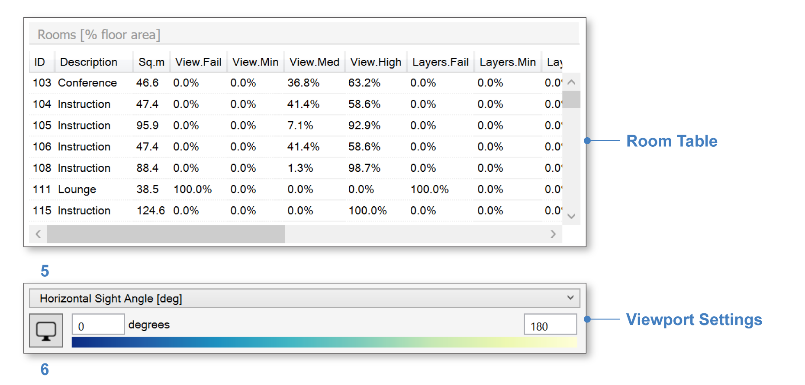

EN 17037 View Out
=========================
EN 17037 is a unified daylighting standard published by the European Committee for Standardization (`CEN`_) in 2018 (CEN 17037:2018). It covers four aspects of daylight in buildings, the second of which -- *View Out* -- is included in ClimateStudio's `View Analysis`_  workflow (as of ClimateStudio v1.5). 

At the top of the View result's EN 17037 tab is a dashboard showing the percentage of the building's floor area that falls into each of four compliance categories: Failing, Minimum, Medium, and High. A falsecolor map of qualifying view locations is also displayed the Rhino viewport:

.. _CEN: https://www.cen.eu/
.. _View Analysis: viewAnalysis.html
.. _results panel: results.html

   

   
The compliance levels are based on three assessments, which are carried out for every view position:

- **Horizontal Sight Angle**: The total horizontal angle (in the XY-pane) subtended by windows from the viewing position. Achieving Minimum compliance requires an angle of at least 14 degrees. Medium and High levels of compliance require angles of 28 and 54 degrees respectively.

|

- **Outside View Distance**: The median view distance from the window to objects seen outside the window. Thresholds for Minimum, Medium, and High levels of compliance are 6, 20, and 50 meters. The median is assessed using all pixels containing through-window views to the outside from the viewing position, as described `here`_.

.. _here: viewDistance.html

.. _results panel: results.html
   
- **Number of View Layers**: EN 17037 defines three view layers: Sky, Ground, and Landscape. The Landscape layer includes both natural elements and buildings -- in other words, everything *except* sky and man-made ground. A view position must see at least the Landscape layer in order to achieve Minimum compliance. Medium compliance requires seeing the Landscape layer plus one other. High compliance requires seeing all three. ClimateStudio considers all exterior elements not labeled with a *Ground* tag (see `setup instructions`_) to be part of the Landscape layer. ClimateStudio also considers ground-hemisphere view rays that escape the scene within five degrees of the horizon to be part of the Landscape layer. The justification for this is that distant, near-horizon views must contain *either* buildings or natural landscape, even if neither is modeled explicitly.

.. _setup instructions: viewAnalysis.html
   
The overall compliance level for each view position is the worst performer among the three criteria above. 

Below the dashboard is the Room Table, which lists compliance level percentages for each regularly occupied floor area, as well as a Viewport Settings bar, which contains a legend, a settings button (6), and a dropdown (5), which can be used to change the displayed metric:

|

Metrics include compliance levels for each assessment criterion, as well as their underlying quantities, e.g. Horizontal Sight Angle, which is displayed using a continuous gradient:

