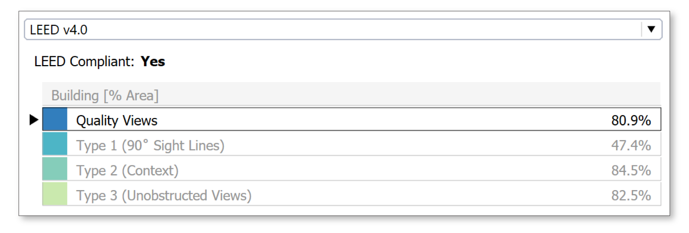
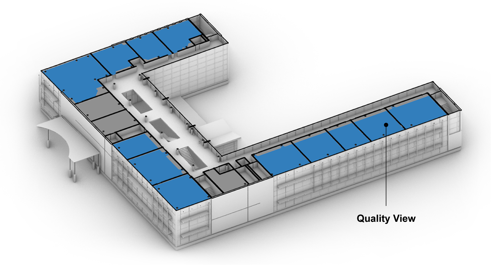
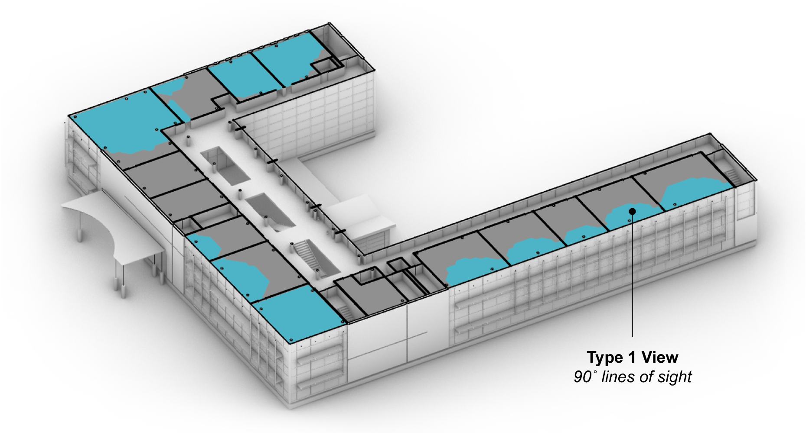
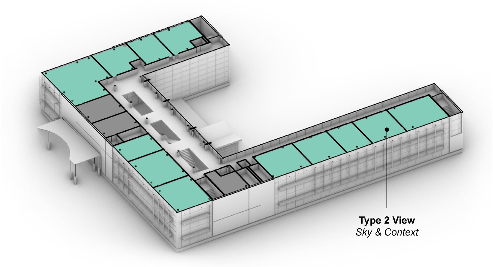
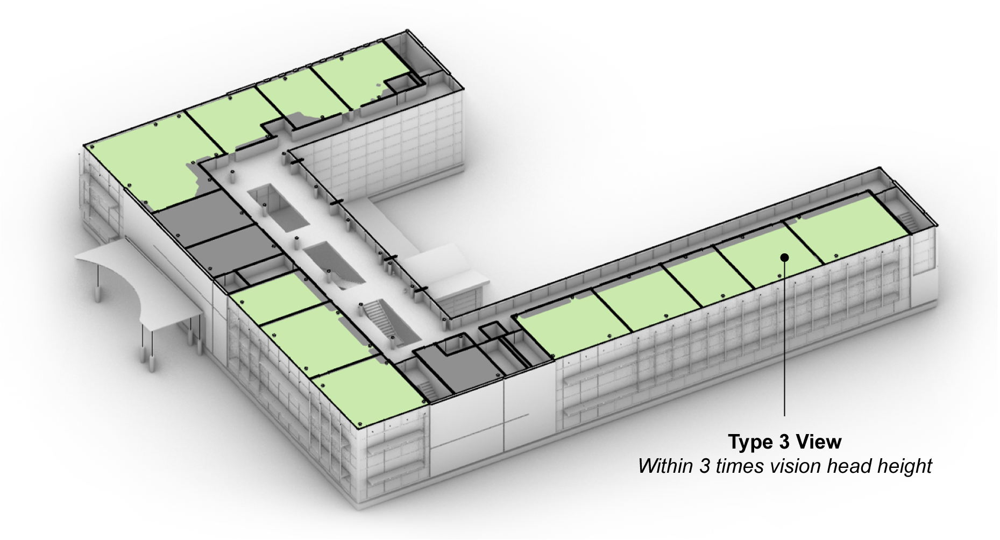
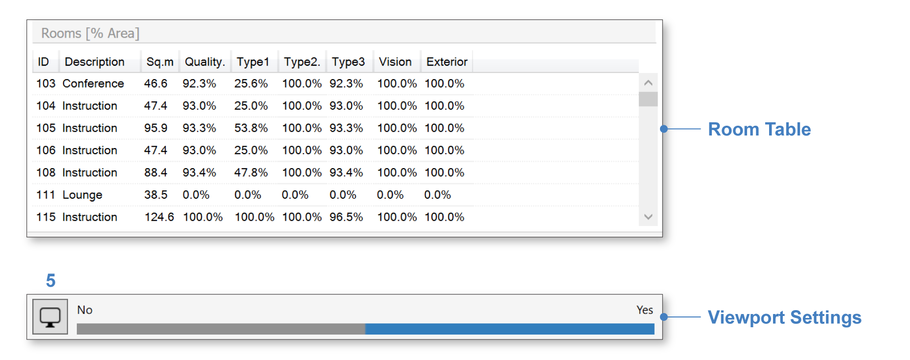
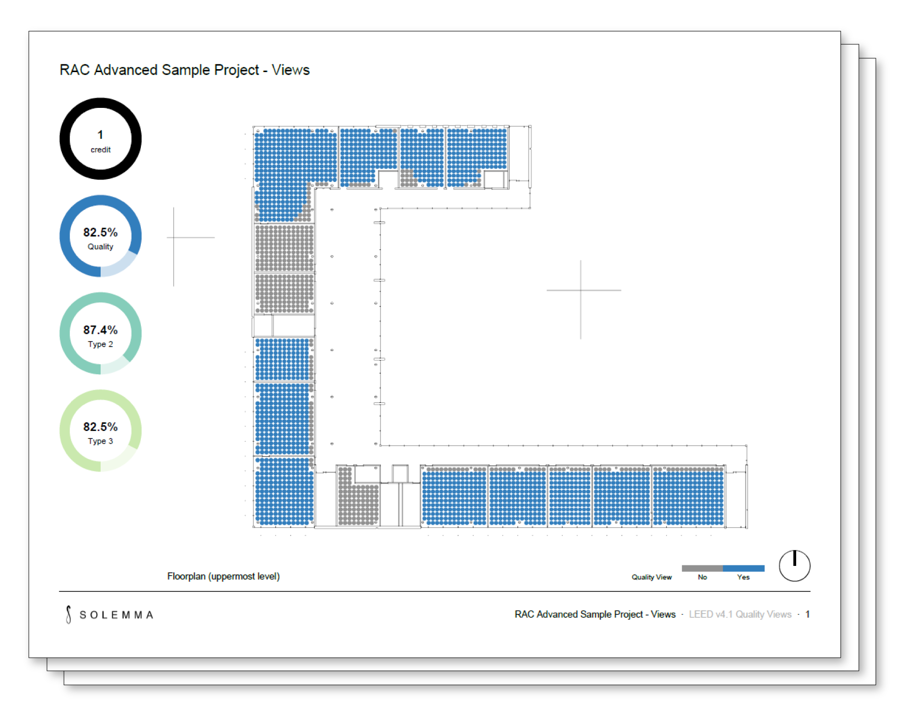
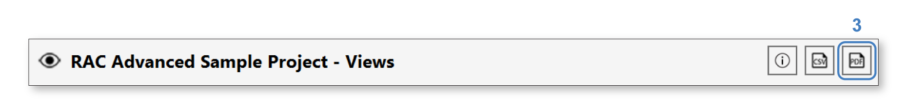
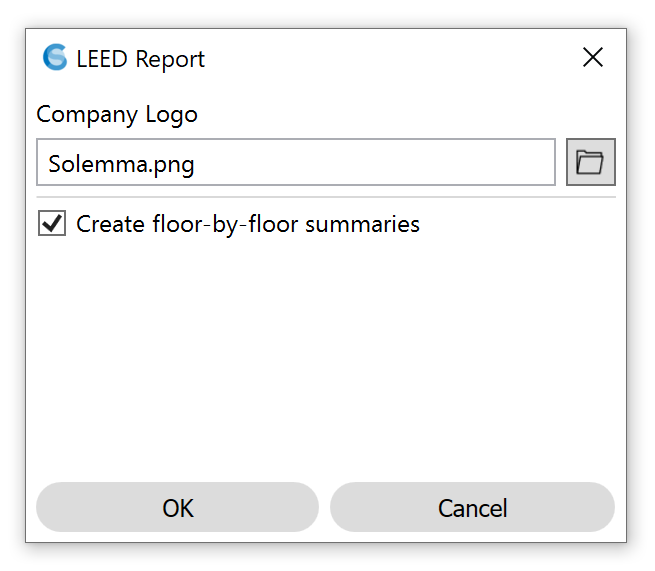

LEED v4 Quality Views
=========================
The LEED v4 Quality Views credit is computed as part of the View Analysis workflow (see `setup instructions`_). It is an Indoor Environmental Quality credit within the Leadership in Energy and Environmental Design (`LEED`_) green building rating system, maintained by the US Green Building Council (`USGBC`_). At the top of the View result's LEED tab is a dropdown offering two versions of the Quality Views credit (4.0 and 4.1), followed by a dashboard with up to four metrics, which correspond to four types of view:

.. _setup instructions: viewAnalysis.html
.. _LEED: https://www.usgbc.org/leed
.. _USGBC: https://www.usgbc.org/

   
The value listed next to each metric is the percentage of the regularly occupied building floor area possessing a view of the given type. The types are defined as follows:
   
- **Quality Views**: The definition of a Quality View differs between LEED versions 4.0 and 4.1. In version 4.0, a Quality View is a location possessing two of the three view types that follow (Types 1-3). In version 4.1, a Quality View is a location possessing *both* Type 2 and Type 3 views (Type 1 is not considered). To qualify for a credit, at least 75% of the regularly occupied building floor area must have a Quality View. For each view type, clicking on the dashboard row displays a map of qualifying view locations in the Rhino viewport:
   

- **Type 1: Multiple lines of sight**: A view location with multiple lines of sight to vision glazing at least 90 degrees apart. This type is considered only in LEED v4.0. 
   

- **Type 2: Context and sky**: The definition of a Type 2 view differs between LEED versions 4.0 and 4.1. In version 4.0, a Type 2 view includes at least *two* of the following: (1) vegetation / sky, (2) movement, and (3) objects at least 25 feet from glazing. In version 4.1, a Type 2 view includes at least *one* of the following: (1) nature / art / urban landmarks, or (2) objects at least 25 feet from glazing.

- **Type 3: Unobstructed**: A view location with a line of sight to vision glazing from within three times its head height.

LEED v4.0 also specifies a fourth type of view that is *not* assessed by ClimateStudio, involving angular factors defined in *Windows and Offices: A Study of Office Worker Performance and the Indoor Environment*. Below the dashboard is the Room Table, which lists view type percentages for each regularly occupied floor area, and a Viewport Settings bar, which contains a legend and settings button (5) for adjusting the display:

Reporting
-----------

A key ClimateStudio feature is its ability to create automated simulation reports in PDF format. To generate a report, click the PDF button (3) in the result header. 

The report generator allows you to customize your report by adding your company logo.

An example report can be `downloaded here`_. 

.. _downloaded here: https://climatestudiodocs.com/ExampleFiles/RAC_Advanced_Sample_Project-LEEDv4.1_Quality_Views_Report.pdf

