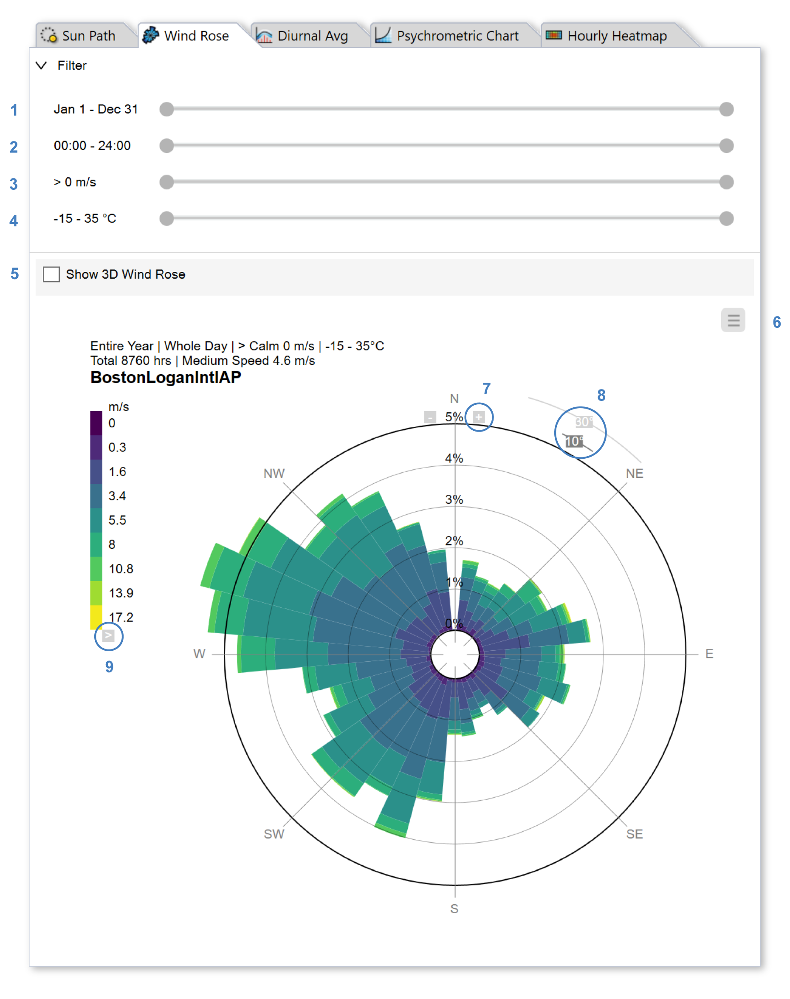
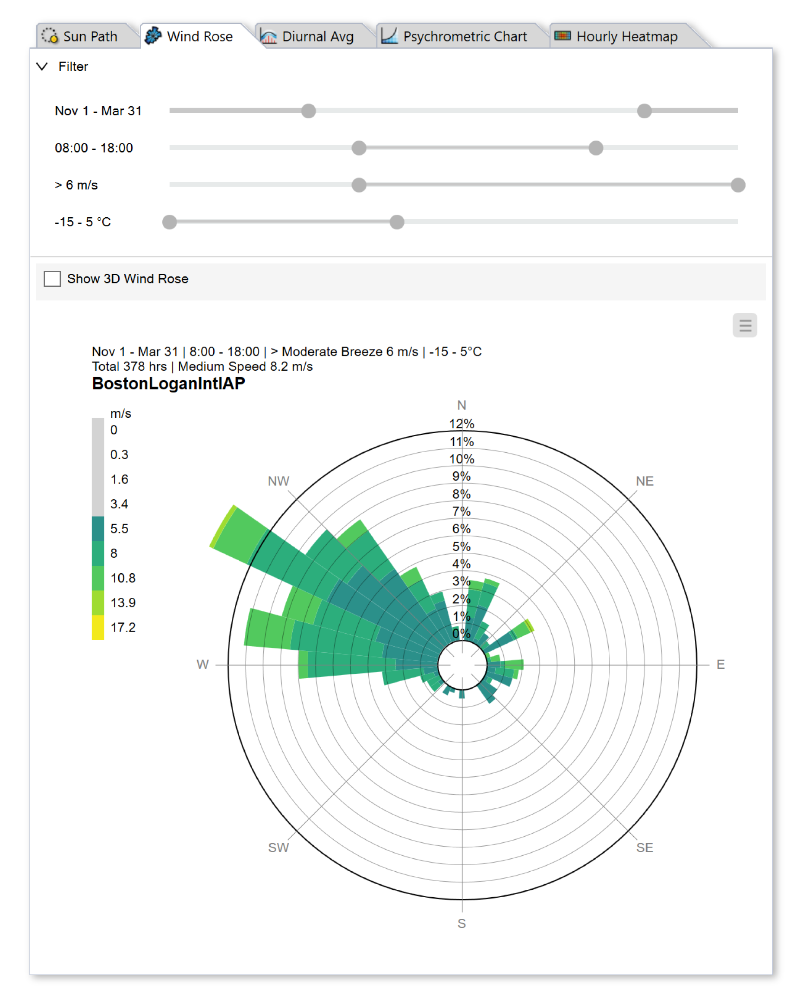
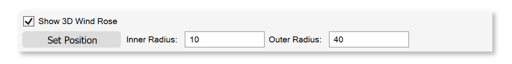
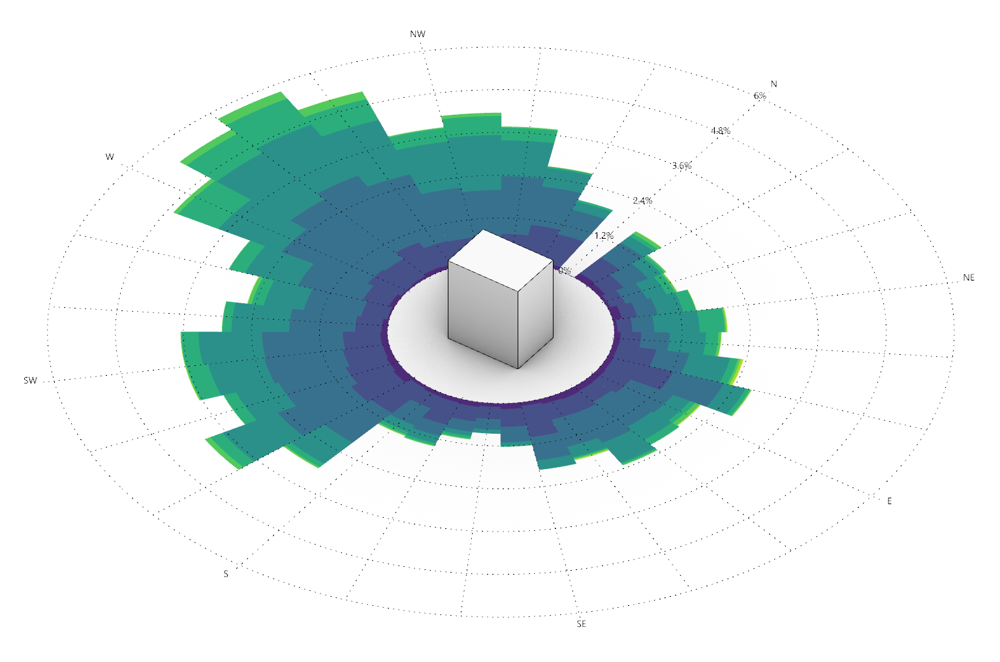

Wind Rose
================================================
The wind rose tab generates 2D and 3D wind rose diagrams, which plot the frequency of wind by speed and direction.

   
You can rescale the radial axis by moving your cursor near the North label ("N") at the top of the plot. Small +/- buttons will appear (7) that increment or decrement the range. You can also toggle between 10 and 30 degree bin sizes (8). To change the falsecolor palette, hover over the legend and click the gray arrow (9), which opens an options dialog. Use the menu (5) to change units, or `export`_ the 2D plot to PNG or PDF.

.. _export: exportPlots.html

A key feature of the wind rose diagram is its filtering capacity. To isolate a particular set of conditions, use the range sliders at the top of the panel, which constrain the data by date (1), hour (2), wind speed (3) and dry bulb temperature (4). The date and hour sliders are *wrappable*, meaning the start and end anchors can be dragged past one another to select winter or nighttime periods. For example, one can quickly isolate daytime winter conditions in which high winds are undesirable for thermal comfort. For the Boston weather file, these winds are coming predominantly from the West/Northwest:

To visualize the wind rose in the Rhino viewport, check the 3d wind rose option (3). Use the Set Position button to relocate the center of the wind rose, and the inner and outer radii to adjust its size.

   

