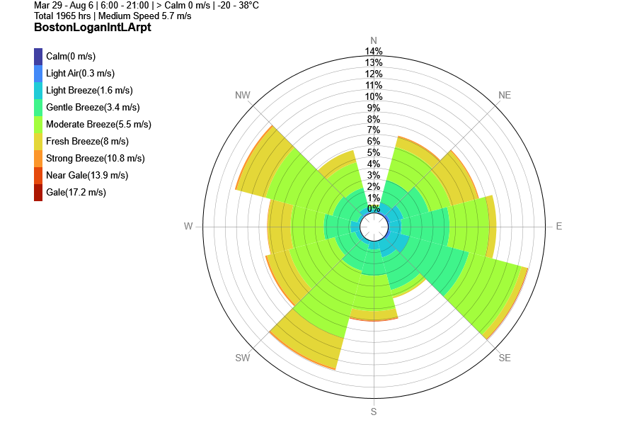

Wind Rose
================================================

2D Wind Rose
----------------------------------------------------

Wind Rose diagram displays a radial bar chart showing the occurrence frequency of wind speed across all directions. 

4 filters can be applied to Wind Speed/Direction Data: 

- **Days** of the year as a range (wraps around)
- **Hours** of day as a range (wraps around)
- **Wind speed** as a range
- **Temperature** as a range

.. figure:: images/windspeed_range.jpg
   :width: 900px
   :align: center

The 2D Wind Rose diagram is customizable: 

- **Y-axis** increase / decrease of bar chart maximum
- **10 - 30 degrees** bin switching
- **Color** gradient selection

.. figure:: images/windrose-customizable.jpg
   :width: 900px
   :align: center
